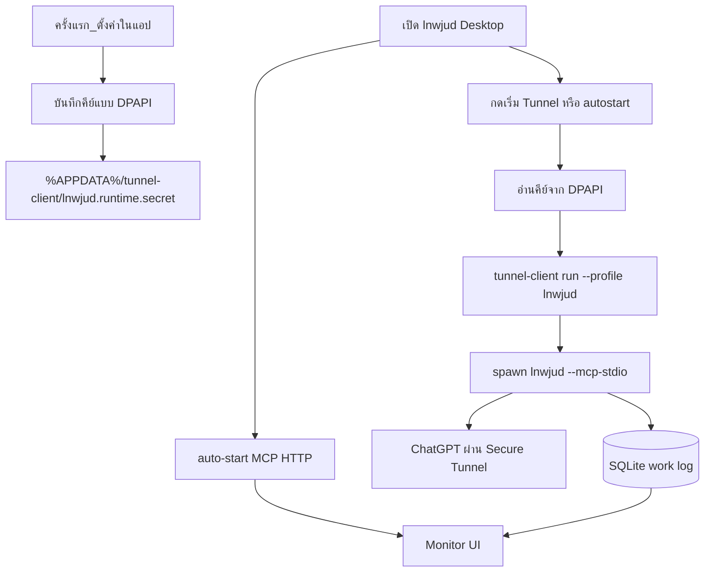
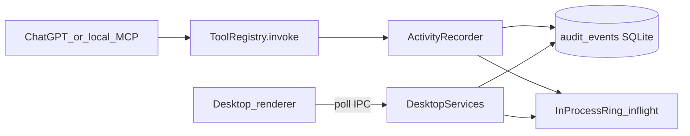

# Agent Control Center Dashboard

## เป้าหมาย

ทำให้ [apps/desktop](apps/desktop) เป็น **ศูนย์ควบคุม Agent** แบบ monitor คล้ายรูปที่ส่งมา: เปิดแอปแล้วเห็น UI + Agent พร้อมทำงานทันที, เลือกโปรเจกต์, คัดลอกช่องทางเชื่อม ChatGPT, และดู **Work Log** realtime — พร้อม **ดีไซน์ใหม่**

**UX หลัก (ตามที่ต้องการ):** รันคำสั่งเดียว → ขึ้นหน้าต่าง monitor → สถานะ “Agent พร้อมทำงาน” **โดยไม่ต้องกด Start/Stop** (MCP HTTP auto-start ตอน boot). ปุ่ม หยุด / รีสตาร์ท / รีเฟรช ยังมีเป็น secondary เหมือนคู่แข่ง

## ข้อจำกัดของผลิตภัณฑ์ (ล็อกไว้)

- **ตัดออกถาวร:** ไม่มี ngrok, Cloudflare Tunnel, หรือ public URL exposer ใดๆ ในแอป / docs ใหม่ / UI
- ช่องทางเชื่อมภายนอกมีแค่ **OpenAI Secure MCP Tunnel** (outbound) + **loopback HTTP** สำหรับ local
- การ์ดช่องทางเชื่อมจะแสดง:
  - **Local Streamable HTTP:** `http://127.0.0.1:<port>/mcp` (พร้อมทันทีหลังเปิดแอป)
  - **ChatGPT web:** สถานะ Secure MCP Tunnel + ปุ่มเริ่ม/หยุด tunnel จาก UI (ดูหัวข้อถัดไป)
- ไม่พ่น API key ลง log หรือ SQLite แบบ plain text

## Secure MCP Tunnel + คีย์ (ตอบคำถาม start-lnwjud-tunnel.ps1)

ตอนนี้คุณรันแยก:

```powershell
powershell -NoProfile -ExecutionPolicy Bypass -File "C:\Users\ABCz\Downloads\tunnel\start-lnwjud-tunnel.ps1"
```

แล้วโดนถาม `Paste Runtime API key` ทุกครั้ง เพราะสคริปต์นั้นใช้ `Read-Host -AsSecureString` แล้วใส่ `CONTROL_PLANE_API_KEY` — **ไม่ได้เซฟคีย์**

ใน Control Center จะรวมเป็น flow นี้:




**ครั้งแรกเท่านั้น (ใส่คีย์ครั้งเดียว):**

1. เปิด Desktop → ตั้งค่า / การ์ด Tunnel
2. ชี้ path ของ `tunnel-client.exe` (default ตรวจ `Downloads\tunnel\tunnel-client.exe`)
3. วาง Runtime API key ครั้งเดียว → เข้ารหัส DPAPI เก็บที่ `%APPDATA%\tunnel-client\lnwjud.runtime.secret` (ตามแบบที่ README มีอยู่แล้ว — ไม่เก็บ plain text ใน repo)
4. ตรวจว่ามี profile `lnwjud.yaml` แล้ว (ถ้ายังไม่มี แสดงลิงก์/คำสั่ง `tunnel-client init` จาก README)

**วันต่อวัน (ไม่ต้องวางคีย์ซ้ำ):**

1. `pnpm desktop` / เปิด `lnwjud.exe` → UI + MCP local พร้อม
2. กด **เริ่ม Tunnel** ในแอป (หรือใช้ Scheduled Task ที่ติดตั้งครั้งเดียว) → อ่านคีย์จากไฟล์ DPAPI → รัน `tunnel-client` โดยไม่ถามคีย์
3. ไปใช้ ChatGPT ตามเดิม; Work Log ใน UI อัปเดตจาก SQLite ร่วม (`LNWJUD_DATA_PATH` ให้ตรงกับ stdio)

**สถานะบนหน้าหลัก:**

- Tunnel: หยุด / กำลังเชื่อม / เชื่อมแล้ว (ตรวจ process `tunnel-client.exe` + profile lnwjud)
- ปุ่ม: เริ่ม Tunnel / หยุด Tunnel / เปิดโฟลเดอร์ log
- ถ้ายังไม่มีคีย์ที่เซฟ → แสดง “ต้องบันทึก Runtime API key ครั้งแรก” แทนการบังคับวางทุกครั้งใน PowerShell

**สิ่งที่แอปจะทำ (concrete):**

- เพิ่ม helper ใน Desktop main: `saveTunnelApiKey`, `startTunnel`, `stopTunnel`, `getTunnelStatus` (IPC)
- Launcher อิงพฤติกรรมสคริปต์เดิม (`doctor` แล้ว `run --profile lnwjud --mcp.connection-max-ttl 24h`) แต่โหลดคีย์จาก DPAPI แทน `Read-Host`
- ไม่ bundle `tunnel-client.exe` เข้า installer ในรอบนี้ — อ้าง path ที่ผู้ใช้ตั้ง; optional: ปุ่ม “ติดตั้ง autostart ตอนล็อกอิน” เรียก logic คล้าย [install-lnwjud-tunnel-autostart.ps1](C:/Users/ABCz/Downloads/tunnel/install-lnwjud-tunnel-autostart.ps1)

**สิ่งที่ยังต้องมีจาก OpenAI (นอกแอป):**

- สร้าง tunnel + Runtime API key บน Platform (ครั้งเดียว)
- สร้าง ChatGPT developer app ชี้ tunnel (ครั้งเดียว)
- คีย์ยังจำเป็น — แค่ไม่ต้องวางใหม่ทุกครั้งที่รัน PS1

## Auto-start + คำสั่งเดียว

ตอนนี้ Desktop สร้างหน้าต่างอย่างเดียว ([bootstrapDesktop](apps/desktop/src/main/main.ts)) — MCP ต้องกด Start ใน UI

**เปลี่ยนเป็น:**

1. หลัง `createDesktopRuntime` + มี workspace (default จาก cwd / workspace ที่เลือกไว้ / workspace แรก) → **เรียก `mcpLifecycle.start` อัตโนมัติ**
2. ถ้ายังไม่มี workspace → ลงทะเบียนจาก `process.cwd()` หรือ `LNWJUD_WORKSPACE` แล้วค่อย start (แนวเดียวกับ stdio bootstrap)
3. UI โชว์ “Agent พร้อมทำงาน” เมื่อ `mcp.running === true`; ถ้า start ไม่สำเร็จโชว์ error + ปุ่มลองใหม่
4. เพิ่มสคริปต์ root `**pnpm desktop**` (หรือ `pnpm start`) ที่ build desktop แล้วเปิด Electron ในคำสั่งเดียว — แทน flow ปัจจุบันที่ต้อง `pnpm build` แล้ว `cd apps/desktop` แล้ว `electron ...`

## วิธีรันทั้งหมด (จะเขียนลง README ด้วย)

### A) Monitor UI วันต่อวัน (เป้าหมายหลัก)

จาก root repo หลัง `pnpm install` ครั้งแรก:

```powershell
Set-Location E:\lnwjud
corepack pnpm@10.15.0 desktop
```

ผลลัพธ์: เปิดหน้าต่างศูนย์ควบคุม + MCP loopback พร้อมแล้ว → คัดลอก URL จาก UI ไปใส่ client local ได้ทันที

ติดตั้งแล้ว (หลัง `package:windows`):

```text
ดับเบิลคลิก lnwjud / Start Menu shortcut
```

หรือ:

```powershell
& "$env:LOCALAPPDATA\Programs\lnwjud\lnwjud.exe"
```

### B) ChatGPT web (Secure Tunnel)

**ครั้งแรก:** ใน Desktop → ตั้งค่า Tunnel → บันทึก Runtime API key (DPAPI) + ตรวจ `tunnel-client.exe` / profile `lnwjud`

**วันต่อวัน — ทางเลือก A (แนะนำ):** เปิด Desktop แล้วกด **เริ่ม Tunnel** (ไม่ต้องรัน PS1 / ไม่ถามคีย์)

**วันต่อวัน — ทางเลือก B:** ยังใช้สคริปต์ได้ แต่ควรอัปเกรดให้โหลด DPAPI แทน Read-Host:

```powershell
# ไม่ต้องวางคีย์ทุกครั้ง ถ้านบันทึก secret แล้ว
powershell -NoProfile -ExecutionPolicy Bypass -File "$env:APPDATA\tunnel-client\run-lnwjud-tunnel-background.ps1"
```

หรือ Scheduled Task `lnwjud Secure MCP Tunnel` ตอนล็อกอิน

**เลิกใช้แบบเก่าเป็นค่าเริ่มต้น:** `start-lnwjud-tunnel.ps1` ที่ `Read-Host` ทุกครั้ง — คงไว้เป็น fallback ถ้ายังไม่เซฟคีย์

Work Log บน UI อ่านจาก SQLite ร่วมกับ `--mcp-stdio` ที่ tunnel-client spawn

### C) เฉพาะ MCP ไม่มี UI (headless)

```powershell
lnwjud.exe --mcp-stdio
# หรือ electron/cli entry ตาม docs
```

### สิ่งที่ไม่ต้องทำใน happy path

- ไม่ต้องกด Start Connection ทุกครั้งที่เปิดแอป
- ไม่มี ngrok / Cloudflare / public tunnel

## สถาปัตยกรรมข้อมูล Work Log




- Instrument ที่ [packages/mcp-server/src/tool-registry.ts](packages/mcp-server/src/tool-registry.ts): ทุก `invoke` บันทึก `started` → `ok`/`error` พร้อม `durationMs`, `targetSummary` (path/command ย่อ), `workspaceId` จาก input ถ้ามี
- ใช้ [packages/audit](packages/audit) ที่มี schema พร้อมแล้ว (`action`, `target_summary`, `result_code`, `metadata`) — ขยาย helper เช่น `recordMcpTool(...)` แทนการบันทึกแค่ `codex_run`
- **In-process ring** สำหรับสถานะ `busy` / in-flight ใน Desktop HTTP MCP
- **ข้ามโปรเซส (stdio tunnel):** Desktop อ่าน SQLite ร่วม — ต้องให้ stdio ใช้ data path เดียวกับ Desktop (`LNWJUD_DATA_PATH` หรือค่า default ที่เอกสารชัด); UI จะเห็น completed events จาก ChatGPT แม้ GUI กับ stdio คนละ process

## Backend / IPC ที่จะเพิ่ม

ใน [packages/ipc-contracts](packages/ipc-contracts/src/index.ts) + preload + [desktop-services.ts](apps/desktop/src/main/desktop-services.ts):


| Channel / field                      | หน้าที่                                                                    |
| ------------------------------------ | -------------------------------------------------------------------------- |
| `selectWorkspace`                    | ตั้ง active workspace (เลิก hardcode `workspaces[0]`)                      |
| `restartMcp`                         | stop แล้ว start กับ workspace ที่เลือก (ใช้เมื่อสลับโปรเจกต์หรือ recovery) |
| `listWorkLog` / รวมใน `getDashboard` | ดึง events ล่าสุด (เช่น 100) + `inFlight[]` + `agentState: idle            |
| `clearWorkLog`                       | ล้างประวัติที่แสดง (truncate หรือ soft-clear ตาม repo pattern)             |
| DashboardSnapshot ขยาย               | `connectionModes` (http url, stdio command), `mode` (WORK), info cards     |


Persist selected workspace id ใน SQLite/settings ที่มีอยู่ (หรือไฟล์เล็กใน data path) เพื่อไม่หายหลังรีสตาร์ท

**สลับโปรเจกต์:** เลือกใน UI → persist → **auto restart MCP** กับ workspace ใหม่ (ผู้ใช้ไม่ต้องกด Start เอง)

## UI / ดีไซน์ใหม่

รีสตรัคเชอร์ renderer เป็น shell แบบ Control Center **full dark theme** (ทั้ง sidebar + main — ไม่ใช้พื้นสว่าง):

- **Theme:** charcoal / near-black surfaces (`#0B0F14` → `#151B24`), border บาง `#2A3340`, text หลัก `#E8EEF5`, muted `#8B97A8`, accent **teal** สำหรับสถานะพร้อม + **copper** สำหรับ emphasis — ไม่มี light mode ในรอบนี้
- **Font:** **Prompt** (OFL) — คัดลอก `.ttf` จาก `C:\Users\ABCz\Downloads\Prompt` เข้า [apps/desktop/src/renderer/fonts/prompt/](apps/desktop/src/renderer/fonts/prompt/) พร้อม `OFL.txt`; โหลดผ่าน `@font-face` (อย่างน้อย Regular / Medium / SemiBold / Bold; italic ตามที่ใช้จริง) แล้วตั้ง `font-family: "Prompt", sans-serif` ทั้งแอป; Work Log ใช้ Prompt หรือ Prompt + tabular/monospace fallback สำหรับ timestamp
- **Sidebar:** แบรนด์ `lnwjud` + เวอร์ชัน, เมนู หน้าหลัก / โปรเจกต์ / Git / บันทึกการทำงาน / ตั้งค่า / Doctor, footer สถานะ Windows Desktop
- **Main:** หัวข้อ “ศูนย์ควบคุม Agent”, badge พร้อม/กำลังทำงาน/หยุด, ปุ่มหลักคือ **รีเฟรช** + **หยุด/รีสตาร์ท** (ไม่โชว์ “Start” เป็นขั้นตอนบังคับตอนเปิด)
- **หน้าหลัก:** การ์ดสถานะ Agent + การ์ดช่องทาง MCP/ChatGPT (copy) + เลือกโปรเจกต์ + การ์ด Workspace / Active Project / Mode + Work Log ย่อ
- **โปรเจกต์ / Git / Work Log / ตั้งค่า:** แยกหน้าตาม sidebar (state switch ใน [App.tsx](apps/desktop/src/renderer/App.tsx) ขยายจาก `dashboard \| doctor`)
- **ภาษา (i18n แค่ไทย + อังกฤษ):** dictionary คู่ `th.ts` / `en.ts` + helper `t(key)`; สลับได้จาก header/ตั้งค่า; default **ไทย**; persist locale ใน settings ท้องถิ่น; ชื่อ MCP tool คงภาษาอังกฤษตาม protocol ทั้งสองภาษา
- **Visual direction:** industrial dark monitor + Prompt typography; หลีกเลี่ยง purple glow / cream+terracotta / dense newspaper / light SaaS cards

ไฟล์หลักที่แตะ UI:

- [DashboardPage.tsx](apps/desktop/src/renderer/features/dashboard/DashboardPage.tsx) → แตกเป็น layout + panels ใหม่
- [styles.css](apps/desktop/src/renderer/styles.css) → dark tokens + `@font-face` Prompt + layout sidebar
- เพิ่ม `fonts/prompt/*.ttf`, `shell/AppShell.tsx`, `worklog/WorkLogPanel.tsx`, `home/ControlCenterPage.tsx`, `i18n/{th,en,index}.ts`

## พฤติกรรม Work Log ใน UI

- แสดง timestamp, tag `[TASK]` / `[RESULT]` / `[ERROR]`, ชื่อ tool, summary สั้น
- Filter: ทั้งหมด / เฉพาะ error / ตามหมวด (file, git, process, … จาก prefix ของ tool name)
- Clear history
- Poll ~250–500ms (reuse pattern ใน App.tsx) — ไม่ต้องมี WebSocket ในรอบนี้

## ทดสอบ

- Unit: `ToolRegistry` บันทึก started/completed; audit helper redacts ตามของเดิม
- Unit/IPC: `selectWorkspace`, dashboard รวม work log + agentState
- Desktop e2e: เปิดแอปแล้ว `mcp.running === true` โดยไม่เรียก Start; อัปเดต selectors/ข้อความไทย; เห็น work log หลังเรียก tool ผ่าน local MCP ถ้าทำได้ใน fixture

## นอกขอบเขต (ตัดออก — ไม่ทำ)

- ngrok / Cloudflare Tunnel / public port expose ใดๆ ในแอป
- รวม GUI + stdio ในโปรเซสเดียวแบบ magic (ChatGPT tunnel ยังต้องมี stdio entry แยกตามข้อกำหนด OpenAI)
- แชท Agent ในตัว Desktop
- i18n เกินไทย/อังกฤษ (ไม่มี framework ใหญ่ / ไม่มีภาษาที่ 3)
- รีดีไซน์ Doctor ลึกเกินย้ายเข้า sidebar

