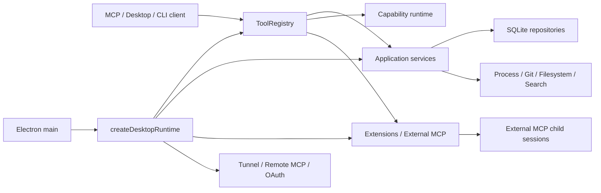

# lnwjud architecture

Audit date: 2026-09-19

## Architectural model

lnwjud is a local AI-agent runtime and MCP gateway using explicit composition roots and service interfaces rather than a global DI container.

The workspace package dependency graph was scanned during this audit and contained no package cycles.

## Request/tool execution path

A normal first-party tool invocation flows through `ToolRegistry.invoke` in `packages/mcp-server/src/tool-registry.ts`:
1. resolve whether the tool is exposed/available,
2. normalize/route active workspace scope,
3. validate schema,
4. apply permission/mutation policy and host approval,
5. apply Ponytail policy when configured,
6. execute the concrete service/runtime adapter,
7. record bounded activity/telemetry/result state.

This central registry is the correct place for cross-cutting invocation policy. New cross-cutting policy should not be reimplemented separately in every tool.

## Desktop composition

`createDesktopRuntime` in `apps/desktop/src/main/desktop-services.ts` is the main production composition root. It currently owns:
- persistent database/repositories,
- workspace/search/project services,
- file/process/Git/capability services,
- backup/recovery,
- durable goals and scheduled continuation,
- external MCP + skill catalog,
- MCP HTTP lifecycle,
- tunnel/remote MCP/OAuth,
- Doctor/readiness/remediation definitions,
- tool availability and activity tracking,
- a large public service facade.

This is correct as a composition boundary, but the function has accumulated policy and operational logic that can be extracted without changing dependency direction.

## Durable goals

Durable goal state is persisted in SQLite and guarded by lease/revision fences. `run_goal`, checkpoint/plan/acceptance tools and finish/cancel operations are public MCP projections over that state.

This audit added an automatic skill preflight to `run_goal`: the goal objective is the only generic orchestration seam that still has enough user intent to rank a relevant skill before later work begins. Low-level file/shell tools do not have the original user request and should not independently guess a skill.

The preflight:
- uses ranked natural-language matching,
- honors explicit skill naming,
- auto-loads only sufficiently relevant non-external skills,
- bounds loaded content to 48 KiB,
- leaves low-confidence requests unmodified.

External-trust skills are not auto-injected unless explicitly named by the user.

## External MCP architecture

`packages/extensions/src/mcp-session-manager.ts` owns external MCP child-session lifecycle, catalog refresh, call serialization, timeout/abort and idle cleanup.

Confirmed bug fixed in this audit:
- a failed close was retained in `closeFailures`;
- after a healthy replacement connection, `lifecycle()` still returned `termination_unverified`;
- callers could therefore see `connected: true` and an unhealthy lifecycle simultaneously.

The corrected precedence is: an active managed session is `connected`; a historical close failure is `termination_unverified` only when there is no active replacement.

A stale child-tool name now returns actionable recovery guidance to refresh the live catalog using `mcp_describe`, which is important when an external MCP server changes tool names between versions.

## Skill discovery and routing

The skill catalog itself was healthy. Workspace `.agents/skills`, bundled roots and user/global roots were discoverable.

The failure was in the old `skill_match` behavior: a complete natural-language request was passed down as one contiguous substring query. Long prompts therefore commonly returned no matches even when a highly relevant skill existed.

The new routing helper tokenizes and scores name/description/id/source matches, handles simple plural normalization, respects the requested limit and keeps explicit user selection above automatic ranking.

## State and ownership risks

The main architecture risk is concentration of stateful policy in a few very large, frequently changed modules rather than package cycles.

Priority extraction candidates:
- Desktop startup/composition vs Doctor/readiness vs tunnel/auth state.
- MCP upgrade-runtime facades grouped by capability domain.
- Durable-goal repository schema/serialization/migration vs workflow-specific query/update operations.
- Electron `main.ts` IPC/bootstrap/update/crash-diagnostics concerns.
- Renderer `App.tsx` page routing/dashboard refresh/application coordination.

Any extraction should preserve current public contracts first; no large rewrite is justified by this audit.
